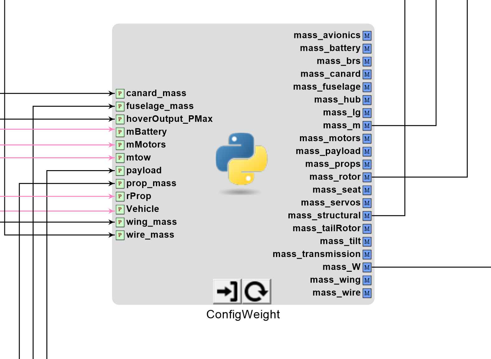
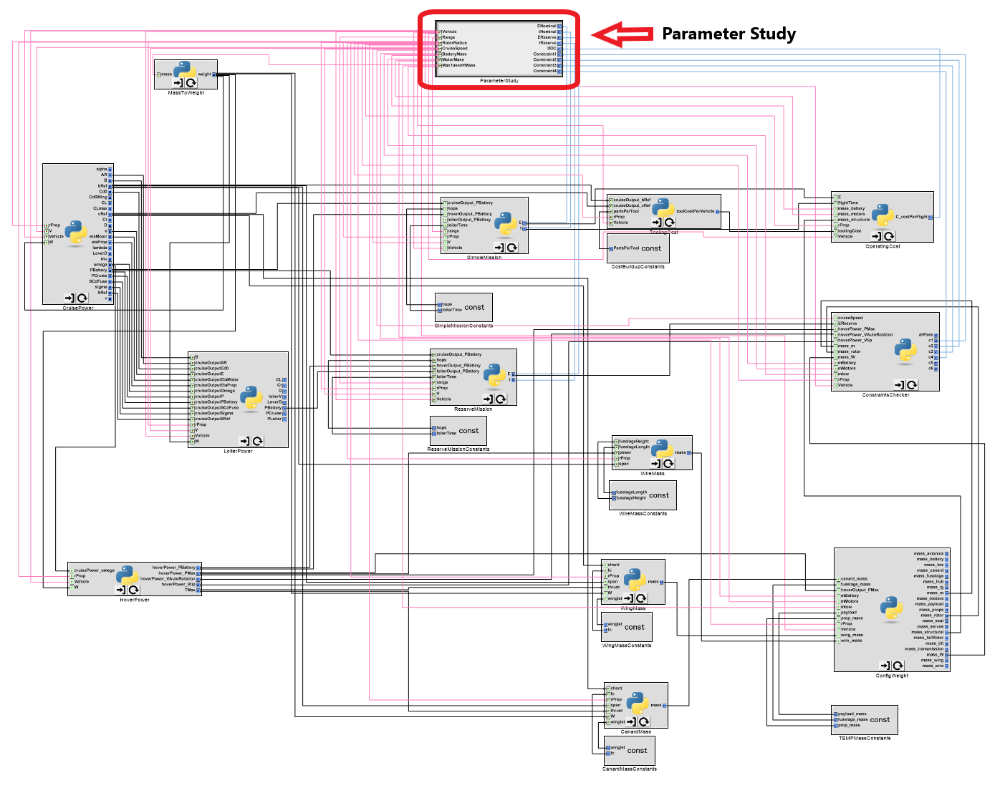
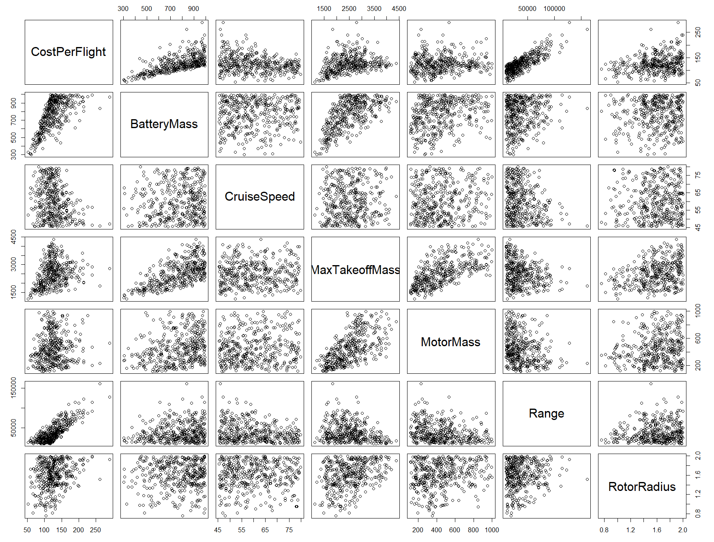

# OpenMETA-Vahana
**Figure 1** - OpenMETA Creo Model of a Possible Vahana Configuration

## 1. Intro
An OpenMETA model for the conceptual design of an autonomous transport aircraft, inspired by the Vahana Project from A^3 by Airbus. The goal was to replicate the Vahan Configuration Trade Study released by A^3 using OpenMETA. 

## 2. Airbus Vahana Configuration Trade Study
Project Vahana is an Airbus A^3's campaign to create a low-cost, single-passenger, electric VTOL aircraft. As part of their design process, Airbus conducted the Vahana Configuration Trade Study to better examine 2 different configurations (an electric helicopter and an electric eight fan tilt-wing) using multidisciplinary design optimization (MDO). 

[A^3 Vahana Configuration Trade Study - Part I](https://vahana.aero/vahana-configuration-trade-study-part-i-47729eed1cdf)

[A^3 Vahana Configuration Trade Study - Part II](https://vahana.aero/vahana-configuration-trade-study-part-ii-1edcdac8ad93)

[A^3 MATLAB source code](https://github.com/VahanaOpenSource/vahanaTradeStudy)

The A^3 team set up a MDO sizing problem in which they compared an electric helicopter model and an electric eight fan tilt-wing model over a range of operating distances (10 km to 200 km in 10 km steps). At each distance, both vehicle models were optimized seperately for Direct Operating Cost (DOC) by varying 5 design variables: Cruise Speed, Rotor Radius, Battery Mass, and Takeoff Mass. The A^3 team also provided the optimizer with 3 constraint equations (4 if the vehicle was a helicopter) that defined certain design requirements - e.g. The vehicle's effective energy capacity (Battery Mass * Battery Energy Density * Battery Discharge Depth) - had to be greater than the amount of energy required to execute a reserve ("worst case") mission. 

This entire optimization process was executed via the following MATLAB scripts:
sizingTradeStudy.m
computePerformance.m
simpleMission.m
reserveMission.m
cruisePower.m
hoverPower.m
loiterPower.m
configWeight.m
wingMass.m
wireMass.m
propMass.m
fuselageMass.m
operatingCost.m
costBuildup.m
toolingCost.m
materials.m

As a result of their Sizing Trade Study, the Vahana team concluded that an electric eight fan tilt-wing configuration would best meet their broad design requirements for a low-cost, single-passenger, electric VTOL aircraft.

## 3. OpenMETA Vahana Configuration Trade Study 
Here at MetaMorph, we set out to first replicate the Vahana Configuration Trade Study's results using the OpenMETA toolset. Since OpenMETA is designed for Multidisciplinary Design Analysis and Optimization, we thought that it would be interesting to see if we could reproduce the A^3 team's results using the OpenMETA toolset.

### 3.a. Conversion from MATLAB Scripts to PythonWrapper Components
In order to set the problem up in OpenMETA, the important MATLAB scripts were first converted to PythonWrapper Components. 

A PythonWrapper is a shell that you can load with a PythonWrapper Component. A PythonWrapper Component is a Python file that contains your model/system/calculations as well as other code that tells OpenMETA what its inputs are, what its outputs are, and how to initialize it. 

So, if you have a model/system/calculation that you want to place in OpenMETA, you can just express it in Python, place your Python inside a PythonWrapper Component, and then load that PythonWrapper Component into a PythonWrapper inside an OpenMETA PET. Once you have done that, you can use your PythonWrapper Component as a 'building block' within your design.

This involved translating each MATLAB script into Python, placing that translated Python into a Python Wrapper Component, and then adding the appropriate parameters/outputs to that Python file. The conversion was not always exact (E.g. costBuildup.m and toolingCost.m were combined into tooling_cost.py). 

Once created, the PythonWrapper Components could then be imported into OpenMETA and manipulated on a Parametric Exploration Tool (PET) canvas.  
**Figure 2** below shows the function configWeight.m being called within computePerformance.m in the Vahana Configuration Trade Study.  
**Figure 3** shows the converted PythonWrapper Component config_weight.py inside an OpenMETA PET. Inputs are on the left side and outputs are on the right side.

**Figure 2** - configWeight.m MATLAB function inside computePerformance.m

**Figure 3** - config_weight.py PythonWrapper Component in PET

Note 1: The MATLAB script configWeight.m returns a single array of values. PythonWrapper Components can also return arrays but in this case, the PythonWrapper Components's outputs were returned as individual scalar values. 

Note 2: Notice that many of the subfunctions that were encapsulated within configWeight.m have been placed in seperate PythonWrapper Components.

In general, PythonWrapper Components offered the following advantages:

* PythonWrapper Components are represented visually within OpenMETA

* PythonWrapper Components can be easily connected to other components (just draw a line)

* PythonWrapper Components can be modified, copied, or imported into other designs

* PythonWrapper Components are fully-compatible with the underlying OpenMDAO framework

...and the following disadvantages:

* The MATLAB scripts had to first be converted to Python

* It is easy to make mistakes when converting complex algorithms between languages

* Converting MATLAB scripts into PythonWrapper Components often changes the structure of the problem. For example, if you have a function x = foo(a, b) that calls another function y = bar(c).  
In MATLAB, you would have two files (foo.m and bar.m) and your data path would look like this:  
a,b -> foo -> c -> bar -> y -> foo -> x.  
a & b are passed into foo. foo passes c into bar. bar returns y to foo. foo returns x.  
However, for PythonWrapper Components (foo.py and bar.py) it often makes more sense to first pass c to bar. bar passes y to foo. a & b are also passed to foo. foo outputs x.  
c -> bar -> y -> foo -> x  
........................ a,b -^

### 3.b. OpenMETA Parameter Study
After converting the major MATLAB scripts in PythonWrapper Components, we added a Parameter Study Component to explore the available design space. The Parameter Study Component allows the user to vary Design Variables (inputs) within defined ranges and record Objectives (outputs). In essence, the Parameter Study Component allows the user to quickly explore the available design space and then view the results of that exploration via the OpenMETA PET Visualizer (or as a raw .csv).

**Figure 4** shows the Parameter Study placed within the larger PET. The Parameter Study is highlighted with a red box. All the other boxes are PythonWrapper Components or Constants Components. The Paremter Study contains 6 design variables (Vehicle, Rotor Radius, Cruise Speed, Battery Mass, Motor Mass, and Maximum Takeoff Weight (actually mass) which it varies between defined lower and upper bounds (taken from sizingTradeStudy.m). For example, Battery Mass is varied betweed 10-999 kg. 

Note: The Tilt-Wing and Helicopter configuration have slightly different ranges for Rotor Radius and Cruise Speed, but for simplicity, those variables were set to cover the ranges of both configurations and extra constraint ouputs were added to check if the specific vehicle's design ranges were violated.

The Parameter Study Component also contains several Objectives, which record system outputs - including DOC and the constraint functions - for each combination of Design Variables injected into the system.

**Figure 5** - Parameter Study Component within Larger PET

Unfortunately, after the first few runs, we quickly realized that - due to the size of the available design space, the constraints, and the desire for a minimized value - a brute force design space exploration was too inefficient for this particular problem. We ran the Parameter Study for 1 million samples using a full factorial approach, but after filtering out the results that violated design constraints, we had only 397 valid designs - a yield rate of less than 0.04%. The valid designs are shown inside the OpenMETA PET Visualizer in **Figure 6**.

**Figure 6** - Parameter Study Results 

### 3.c. OpenMETA Optimizer

### 3.d. Parameter Study + Optimizer

## 4. Improving the Vahana Configuration Trade Study / Future Plans

## References
[Vahana Configuration Trade Study Part - 1](https://vahana.aero/vahana-configuration-trade-study-part-i-47729eed1cdf)

[Vahana Configuration Trade Study Part - 2](https://vahana.aero/vahana-configuration-trade-study-part-ii-1edcdac8ad93)

[MATLAB Code](https://github.com/VahanaOpenSource/vahanaTradeStudy)
