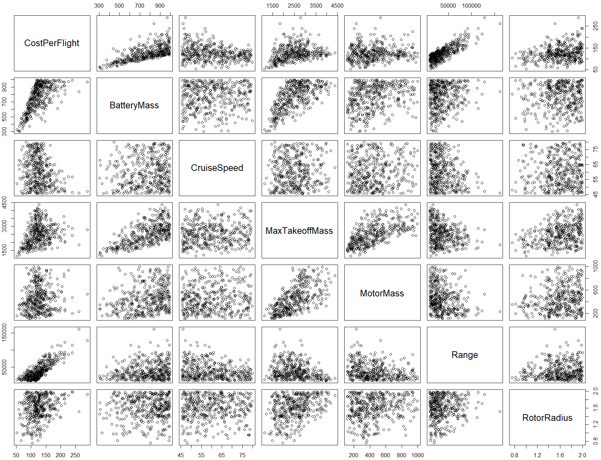
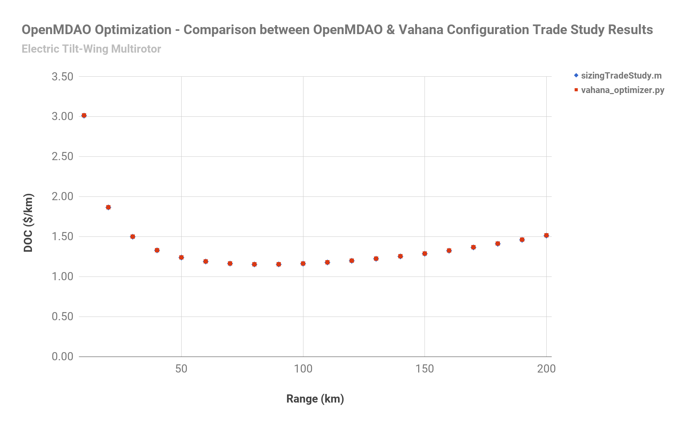
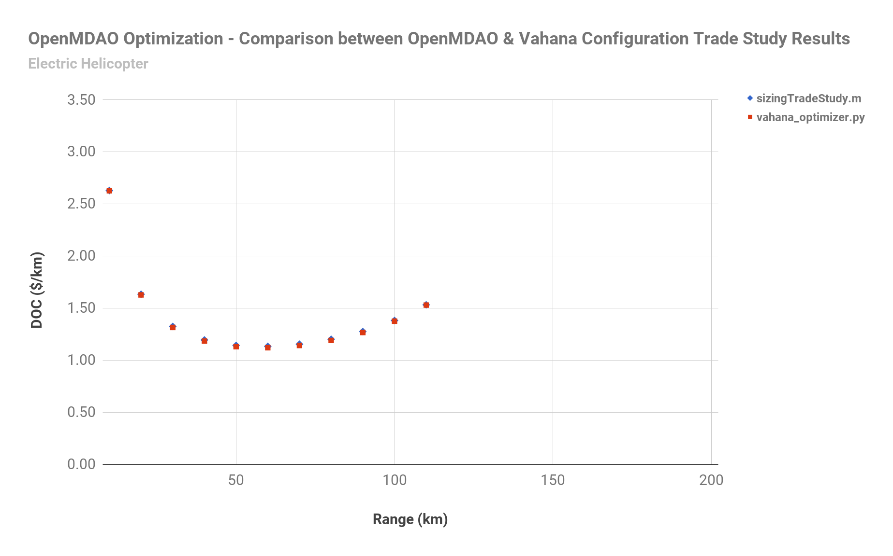
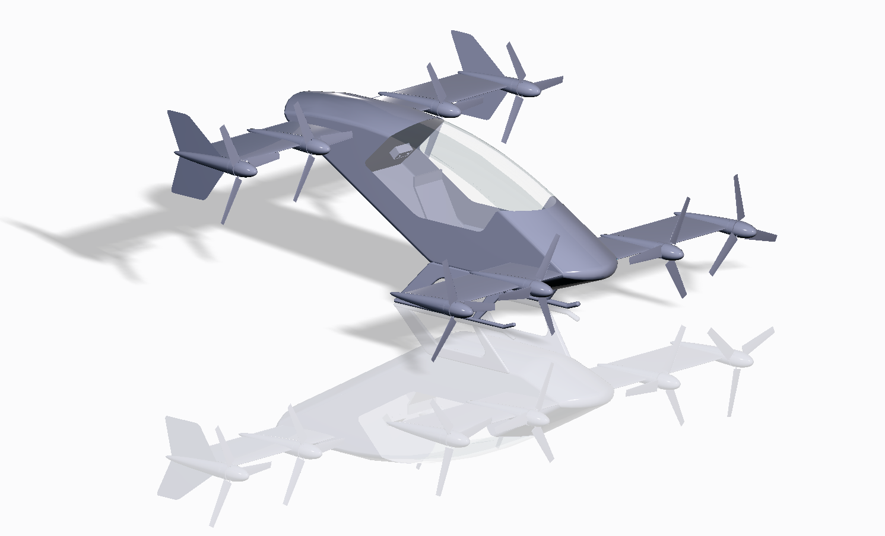

# OpenMETA-Vahana
## Summary

We made an OpenMETA/OpenMDAO model for the conceptual design of an autonomous transport aircraft, inspired by the Vahana Project from A³ by Airbus. We built OpenMETA/OpenMDAO models of the Vahana Tilt-Wing Multirotor aircraft using A³'s released source code as a template. 

A parametric CAD model of the Vahana was also built within OpenMETA with the goal of using CAD analysis to improve the accuracy of future studies. The most recent draft of this CAD model is shown below with its rotors angled to transition between the hover and cruise modes.

**Vahana CAD model:**
  


The OpenMETA/OpenMDAO models were used to perform similar DOC analyses to those in the Vahana Configuration Trade Study as well as improve on the original study. 

**OpenMETA 'Optimizer' Results and Vahana Trade Study Results for Tilt-Wing Configuration at Range of 100 km:**

|                        | DOC ($) | DOC (km/$) | rProp (m) | cruiseSpeed (m/s) | batteryMass (kg) | motorMass (kg) | mtom (kg) |
|:----------------------:|:-------:|:----------:|:---------:|:-----------------:|:----------------:|:--------------:|:---------:|
| OpenMETA |   116.3  |    1.16    |    1.10   |        45.5       |        413       |      66.7      |    968    |
|   Vahana Study   |  116.3  |    1.16    |    1.10   |        45.5       |        413       |      66.7      |    968    |

**OpenMDAO model results:**


## Airbus Vahana Configuration Trade Study

Project Vahana is an Airbus A³ campaign to create a low-cost, single-passenger, electric VTOL aircraft. As part of their design process, Airbus conducted the Vahana Configuration Trade Study to better examine 2 different configurations (an electric helicopter and an electric eight fan tilt-wing) using multidisciplinary design optimization (MDO). 

- [A³ Vahana Configuration Trade Study - Part I](https://vahana.aero/vahana-configuration-trade-study-part-i-47729eed1cdf)
- [A³ Vahana Configuration Trade Study - Part II](https://vahana.aero/vahana-configuration-trade-study-part-ii-1edcdac8ad93)
- [A³ MATLAB source code](https://github.com/VahanaOpenSource/vahanaTradeStudy)

The A³ team set up a MDO sizing problem in which they compared an electric helicopter model and an electric eight fan tilt-wing model over a range of operating distances (10 km to 200 km in 10 km steps). At each distance, both vehicle models were optimized seperately for Direct Operating Cost (DOC) by varying 5 design variables: Cruise Speed, Rotor Radius, Battery Mass, and Takeoff Mass. The A³ team also provided the optimizer with 3 constraint equations (4 if the vehicle was a helicopter) that defined certain design requirements - e.g. The vehicle's effective energy capacity (Battery Mass * Battery Energy Density * Battery Discharge Depth) had to be greater than the amount of energy required to execute a reserve ("worst case") mission. 

This entire optimization process was executed via the following MATLAB scripts:  

- `sizingTradeStudy.m`  
- `computePerformance.m`  
- `simpleMission.m`  
- `reserveMission.m`  
- `cruisePower.m`  
- `hoverPower.m`  
- `loiterPower.m`  
- `configWeight.m`  
- `wingMass.m`  
- `wireMass.m`  
- `propMass.m`  
- `fuselageMass.m`  
- `operatingCost.m`  
- `costBuildup.m`  
- `toolingCost.m`  
- `materials.m`  

As a result of their Sizing Trade Study, the Vahana team concluded that an eight-fan, tilt-wing configuration would best meet their broad design requirements for a low-cost, single-passenger, electric VTOL aircraft.

## OpenMETA Vahana Configuration Trade Study 
Here at MetaMorph, we set out to first replicate the Vahana Configuration Trade Study's results using the OpenMETA toolset. Since OpenMETA is designed for Multidisciplinary Design Analysis and Optimization, we thought that it would be interesting to see if we could reproduce the A³ team's results using the OpenMETA toolset.

### Conversion of MATLAB Scripts to PythonWrapper Components

In order to set the problem up in OpenMETA, the relevant MATLAB scripts were first converted to PythonWrapper components. A PythonWrapper allows us to define an arbitrary block of Python code, e.g. a model, system, or calculation, with specific inputs and outputs. This PythonWrapper component can then be placed within an OpenMETA PET where the inputs and outputs are exposed as ports.

For example, the function `configWeight()` (defined within `configWeight.m`) is called within `computePerformance.m` in the Vahana Configuration Trade Study as seen below.

```Matlab
% Mass estimate  
mass = configWeight(vehicle,rProp,mBattery,mMoters,mtow,hoverOutput,cruiseOutput,payload);
```

We converted the `configWeight.m` script to a PythonWrapper component `config_weight.py` script. When this component is placed within an OpenMETA PET, a block appears representing the script with inputs and outputs on the left and right sides, respectively.

**PythonWrapper Component in PET representing `config_weight.py`:**


For our purposes, the conversion from MATLAB to Python was not always exact. We had to find substitutes for many of the build-in MATLAB functions/constructs, and we took some liberties in recomposing parts of the problem to better fit within the OpenMETA architecture.  
For example, The MATLAB script 'configWeight.m' returns a single array of values. PythonWrapper components can also output arrays but in this case, we wanted the PythonWrapper 'ConfigWeight' to expose individual scalar values as its outputs.

In general, PythonWrapper components:

* are represented visually within OpenMETA
* can be easily connected to other components (just draw a line)
* can be modified, copied, or imported into other designs
* are fully-compatible with OpenMETA's underlying OpenMDAO engine

In combination with other OpenMETA components, PythonWrappers are used as 'building blocks' in building larger systems and models within the Parametric Exploration Tool (PET) canvas. The converted PythonWrapper components are located in `openmeta-vahana/scripts`.

<!--
...and the following disadvantages:

* The MATLAB scripts had to first be converted to Python
* It is easy to make mistakes when converting complex algorithms between languages
* Converting MATLAB scripts into PythonWrapper Components often changes the structure of the problem. For example, if you have a function x = foo(a, b) that calls another function y = bar(c).  
In MATLAB, you would have two files (foo.m and bar.m) and your data path would look like this:  
a,b -> foo -> c -> bar -> y -> foo -> x.  
a & b are passed into foo. foo passes c into bar. bar returns y to foo. foo returns x.  
However, for PythonWrapper Components (foo.py and bar.py) it often makes more sense to first pass c to bar. bar passes y to foo. a & b are also passed to foo. foo outputs x.  
c -> bar -> y -> foo -> x  
........................ a,b -^ -->

### OpenMETA Using a 'Parameter Study' Driver

<!-- Talk about composition and what a Parameter Study is.-->

After converting the major MATLAB scripts in PythonWrapper Components, we added a 'Parameter Study' driver to explore the available design space. The 'Parameter Study' driver allows the user to vary Design Variables (inputs) within defined ranges and record Objectives (outputs). In essence, the 'Parameter Study' driver allows the user to quickly explore the available design space and then view the results of that exploration via the OpenMETA PET Visualizer (or as a raw .csv).

The figure below shows the 'Parameter Study' driver located within the larger PET. The 'Parameter Study' is highlighted with a red box. All the other boxes are PythonWrapper components or Constants components. The 'Parameter Study' contains 6 design variables - Vehicle, Rotor Radius, Cruise Speed, Battery Mass, Motor Mass, and Maximum Takeoff Weight (actually mass) - which it varies between defined lower and upper bounds (taken from 'sizingTradeStudy.m'). For example, Battery Mass is varied betweed 10-999 kg. 

The Tilt-Wing and Helicopter configuration have slightly different ranges for Rotor Radius and Cruise Speed, but for simplicity, those variables were set to cover the ranges of both configurations and extra constraint ouputs were added to check if the specific vehicle's design ranges were violated.

The 'Parameter Study' driver also contains several Objectives, which record system outputs - including DOC and the constraint functions - for each combination of Design Variables injected into the system.

**'Parameter Study' driver within Larger PET:**


Unfortunately, after the first few runs, we quickly realized that - due to the size of the available design space, the constraints, and the desire for a minimized value - a brute force design space exploration was too inefficient for this particular problem. We ran the Parameter Study for 1 million samples using a full factorial approach, but after filtering out the results that violated design constraints, we had only 397 valid designs - a yield rate of less than 0.04%. The valid designs are shown inside the OpenMETA PET Visualizer in the figure below. The `Parameter Study` PET is located at `RootFolder/Testing/ParametricExploration/Vahana Parametric Study PET` within openmeta-vahana.xme.

**'Parameter Study' PET Results:**


### OpenMETA Using an 'Optimizer' Driver

Fortunately, OpenMETA also has an 'Optimizer' driver that uses the COBYLA Optimizer. We replaced the 'Parameter Study' Driver with an 'Optimizer' driver and ran the PET again. The table below compares the results from an Optimizer PET to the results from the `tradeStudyResult.mat` file produced by the A³ Vahana Configuration Trade Study.

**OpenMETA 'Optimizer' Results and Vahana Trade Study Results for Tilt-Wing Configuration at Range of 100 km:**

|                        | DOC ($) | DOC (km/$) | rProp (m) | cruiseSpeed (m/s) | batteryMass (kg) | motorMass (kg) | mtom (kg) |
|:----------------------:|:-------:|:----------:|:---------:|:-----------------:|:----------------:|:--------------:|:---------:|
| OpenMETA |   116.3  |    1.16    |    1.10   |        45.5       |        413       |      66.7      |    968    |
|   Vahana Study   |  116.3  |    1.16    |    1.10   |        45.5       |        413       |      66.7      |    968    |

As shown above, for the range of 100 km, the OpenMETA Optimizer obtained similar values to those obtained by the Vahana Configuration Trade Study. The 'Optimizer' PET is located at `RootFolder/Testing/ParametricExploration/Vahana Optimizer PET` within openmeta-vahana.xme.

### 'Optimizer' PET Nested Within 'Parameter Study' PET

The OpenMETA 'Optimizer' produced the same results as the Vahana Configuration Trade Study. However, in OpenMETA's current form, we would have to manually change the Range value and rerun the PET analysis 20 times to recreate the full dataset found in the Vahana Configuration Trade Study. In order to meet this need, we wanted to be able to place an OpenMETA 'Optimizer' driver *inside* of an OpenMETA 'Parameter Study' driver - similar to the  Vahana team's approach of nesting a MATLAB `fmincon()` function within a high-level DoE - so that we could easily generate optimized designs over a range of operating distances from 10 km to 100 km.

While this functionality is not currently within OpenMETA, we were able build it (using PythonWrapper Components) directly on OpenMETA's underlying OpenMDAO framework and obtain good proof-of-concept results that were almost identical to produced by the Vahana Configuration Trade Study. The two figures below shows results from the Vahana Configuration Trade Study and the OpenMDAO Optimizer on the same graph. The nested 'Parameter Study' and 'Optimizer' OpenMDAO drivers are located in `openmeta-vahana/scripts/vahana_optimizer.py` and `openmeta-vahana/scripts/vahana_optimizer_helicopter.py`.

**Comparison of `vahana_optimizer.py` and `sizingTradeStudy.m` results:**


**Comparison of `vahana_optimizer_helicopter.py` and `sizingTradeStudy.m` results:**


The figure below compares the DOC results of the two configurations.

**Comparison of `vahana_optimizer.py` and `vahana_optimizer_helicopter.py` results:**


In the 4th paragraph of the 'Trade Study Results' section of [Vahana Configuration Trade Study — Part II](https://vahana.aero/vahana-configuration-trade-study-part-ii-1edcdac8ad93), A³ Team Member Mr. Geoffrey Bower states that for most transport aircraft the maximum fuel weight is roughly a third of the maximum takeoff weight. Therefore, we added another constraint to the OpenMDAO model that limited battery mass to less than one third of the maximum takeoff mass. This OpenMDAO driver is located in `openmeta-vahana/scripts/fuel-constraint.py`, and results can be seen below. 

**Effect of Added Constraint Limiting Fuel Weight to less than 1/3 of MTOW:**


Enforcing this constraint changes the Tilt-Wing Configuration's DOC curve, causing it to start rising rapidly for operating ranges of 70 km and greater. For the Vahana aircraft's target operational range of 100 km, this weight restriction translates into a $0.32 difference in DOC per a km ($32 per 100 km trip). The Vahana's future operating costs will be substantially affected by Airbus's ability to create designs that can safely exceed this fuel weight restriction as well as the company's success in lobbying for favorable government regulations on this new emerging class of personal, electric VTOL aircraft.

We are currently exploring the possibility of adding the ability for users to place 'Optimizer' drivers inside of 'Parameter Study' drivers within OpenMETA, so that they can easily compose DoE-type optimization problems similar to this one.

## Improvements to Vahana Configuration Trade Study / Future Plans
Since we were able to produce similar trends to those in the Vahana Configuration Trade Study using the OpenMDAO 'Optimizer' driver, we wanted to explore ways in which to improve on the Trade Study's results. Outside of exercising the OpenMETA toolset, there is little reason to recreate the Vahana Configuration Trade Study - it already served its purpose and Aribus has since moved on to the next stage in the design process. Therefore, our next goal was to see how we could improve the Trade Study's model and provide more detailed anaylsis for design purposes.

### Meta-Link CAD Model
A CAD model can provide a more accurate representation of a vehicle's geometry, mass, and mass distribution. In creating a CREO model of the Tilt-Wing Configuration, we hoped to provide a more model that could eventually be used to calculate mass, center of gravity, and production costs.

The model (shown below) is based on the sketches of the Tilt-Wing configuration that A³ released in the Vahana Trade Study Report. This model is composed within GME and contains parametric features that align with the design requirements outlined within the Vahana Trade Study's MATLAB code. The rotational orientation of the wings and canards can be varied between the cruise and hover positions (or 0-90 degrees).


**Vahana in hover mode:**


**Vahana transitioning from hover mode to cruise mode:**


**Vahana in cruise mode:**



The model assembly is located at `RootFolder/ComponentAssemblies/Vahana2` within openmeta-vahana.xme. By changing the values of the `Canard_Rotation` and `Wing_Rotation` parameters, a user can be change the orientation for a specific analysis. The `rProp` parameter allows the user to change vary the length of the propeller blades. Changing the propeller blade radius also changes the span of both flight surfaces as well as the positions of the rotors in order to maintain an appropriate spacing between the neighboring rotors.

### Iterative Mass Calculations
When running the PET 'Parameter Study' we noticed that the low success rate of less than 0.04% was primarily caused by designs failing the first two design constraints:

* The vehicle battery must contain more energy than the energy required to complete its mission 
* The vehicle motors must the capacity to provide at least 1.7 times the maximum power required for hover mode

The Vahana Trade Study set battery mass and motor mass as design variables while using assumed values for battery specific energy and motor specific power. Since 95% of all 'Parameter Study' PET runs failed as a result of the first two constraints, we looked into making battery mass and motor mass dependent variables which could be solved using an iterative method and the other design variables.

Using Euler's linear method of numerical integration (method shown [here](https://docs.google.com/spreadsheets/d/170VYNoF4OTg8ZG605DoPC1EO5k4rxNIF8a00Ac6IGiI/edit?usp=sharing)) the required battery mass and motor mass can be solved for within 0.01% of the theoretical value in 10 interation for ranges up to ten times larger than the assumed payload of 150 kg. A future model may implement these mass calculations in order to more intelligently explore the design space

<!-- Image isn't in images/ ...
<p align="center">Image of Mass Convergence at 1500 kg</p>


-->

## References
[Vahana Configuration Trade Study Part - 1](https://vahana.aero/vahana-configuration-trade-study-part-i-47729eed1cdf)  
[Vahana Configuration Trade Study Part - 2](https://vahana.aero/vahana-configuration-trade-study-part-ii-1edcdac8ad93)  
[MATLAB Code](https://github.com/VahanaOpenSource/vahanaTradeStudy)
