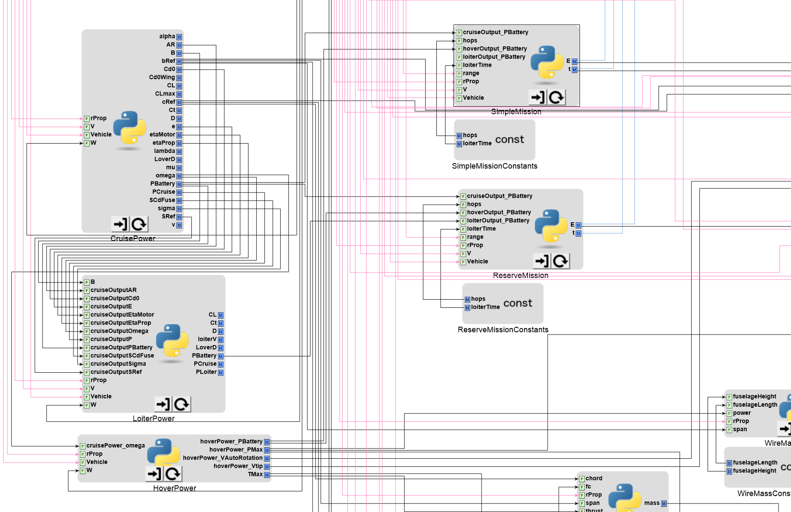
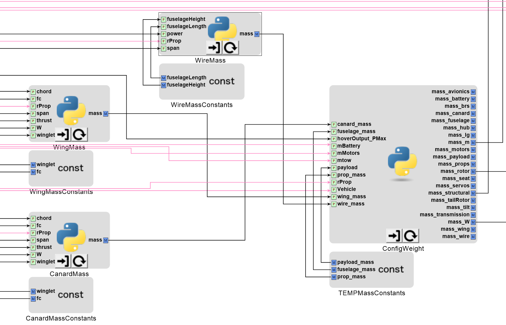

# OpenMETA-Vahana

Figure 1 - Creo Model of a Possible Vahana Configuration

## 1. Intro
An OpenMETA model for the conceptual design of an autonomous transport aircraft, inspired by the Vahana Project from A^3 by Airbus. The goal was to replicate the Vahan Configuration Trade Study released by A^3 using OpenMETA. 

## 2. Airbus Vahana Configuration Trade Study
Project Vahana is an Airbus A^3's campaign to create a low-cost, single-passenger, electric VTOL aircraft. As part of their design process, Airbus conducted the Vahana Configuration Trade Study to better examine 2 different configurations (an electric helicopter and an electric eight fan tilt-wing) using multidisciplinary design optimization (MDO). 

[A^3 Vahana Configuration Trade Study - Part I](https://vahana.aero/vahana-configuration-trade-study-part-i-47729eed1cdf)

[A^3 Vahana Configuration Trade Study - Part II](https://vahana.aero/vahana-configuration-trade-study-part-ii-1edcdac8ad93)

[A^3 MATLAB source code](https://github.com/VahanaOpenSource/vahanaTradeStudy)

The A^3 team set up a MDO sizing problem in which they compared an electric helicopter model and an electric eight fan tilt-wing model over a range of operating distances (10 km to 200 km in 10 km steps). At each distance, both vehicle models were optimized seperately for Direct Operating Cost (DOC) by varying 5 design variables: Cruise Speed, Rotor Radius, Battery Mass, and Takeoff Mass. The A^3 team also provided the optimizer with 3 constraint equations (4 if the vehicle was a helicopter) that defined certain design requirements - e.g. The vehicle's effective energy capacity (Battery Mass * Battery Energy Density * Battery Discharge Depth) - had to be greater than the amount of energy required to execute a reserve ("worst case") mission. 

This entire optimization process was executed via the following MATLAB scripts:
sizingTradeStudy.m
computePerformance.m
simpleMission.m
reserveMission.m
cruisePower.m
hoverPower.m
loiterPower.m
configWeight.m
wingMass.m
wireMass.m
propMass.m
fuselageMass.m
operatingCost.m
costBuildup.m
toolingCost.m
materials.m

As a result of their Sizing Trade Study, the Vahana team concluded that an electric eight fan tilt-wing configuration would best meet their broad design requirements for a low-cost, single-passenger, electric VTOL aircraft.

Here at MetaMorph, we wanted to see if we could set up the same MDO problem and solve it in OpenMETA. 

First, we converted Airbus's MATLAB Code into composable PythonWrapper Components which could then be used as 'building blocks' in the OpenMETA environment.

Figure 2 - PythonWrapper Components for Power and Mission Calculations

Note: In Figure 2, CruisePower has many exposed outputs. One the other hand, HoverPower has only five exposed outputs. When building/modifying a PythonWrapper Component, the user can decide which input/output variables to be exposed.

Figure 3 - PythonWrapper Components for Mass Calculations

Note: Constants Components allow the user to quickly provide constant values to a system. In Figure 3, Constants Components provide WingMass, WireMass, and CanardMass with unique design parameters

Figure 4 - PythonWrapper Components for Cost and Constraint Calculations

## Parameter Study
After converting the major MATLAB scripts in PythonWrapper Components, we added a Parameter Study Component to explore the available design space. Figure 5 shows the Parameter Study has 7 Design Variables on its left side and 8 Objectives on its right side.

Figure 5 - Parameter Study Component

Now we can set the ranges of the design variables in the Parameter Study Component and run the Master Interpreter to generate some data. Let's set the Parameter Study to 1 million samples and run the PET.

Here's a filtered subset of our data in the OpenMETA Visualizer - 397 points to be exact:

 <- Get a higher res image if possible

Figure 5 - Filtered PET Result in Visualizer

## References
[Vahana Configuration Trade Study Part - 1](https://vahana.aero/vahana-configuration-trade-study-part-i-47729eed1cdf)

[Vahana Configuration Trade Study Part - 2](https://vahana.aero/vahana-configuration-trade-study-part-ii-1edcdac8ad93)

[MATLAB Code](https://github.com/VahanaOpenSource/vahanaTradeStudy)
