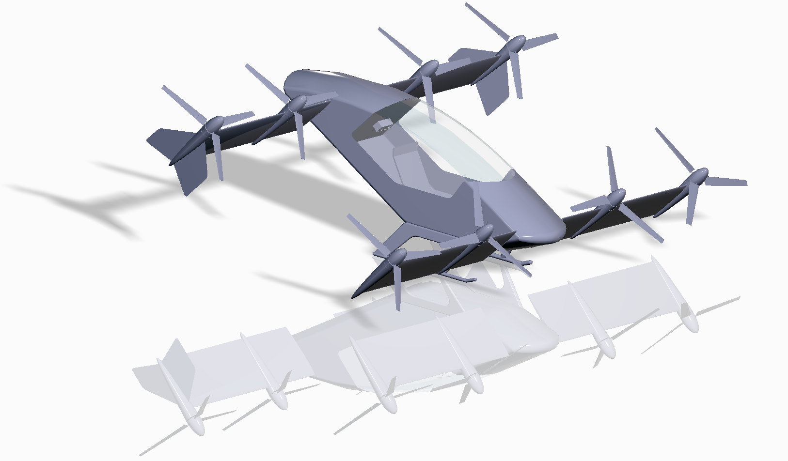
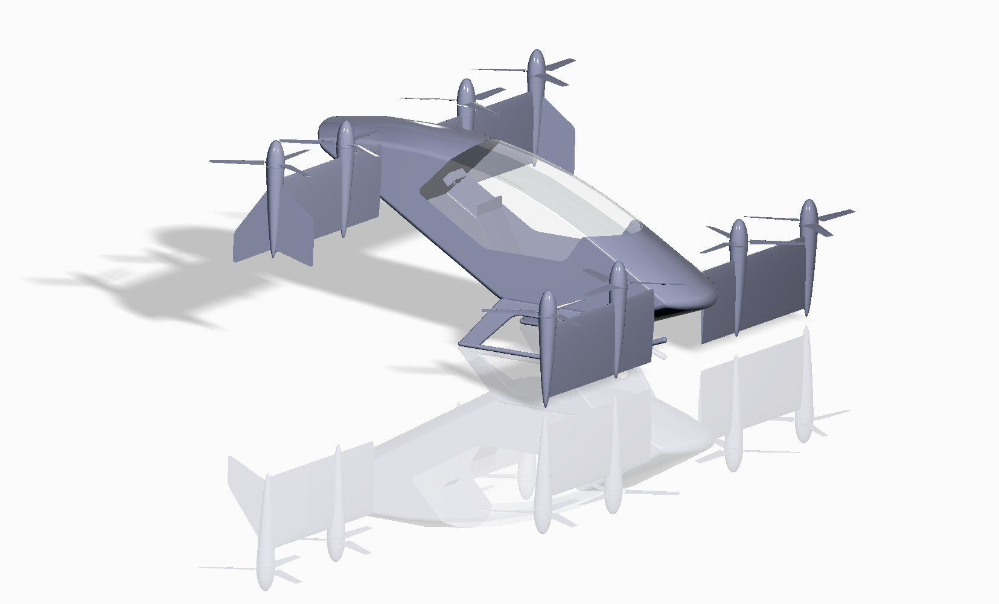

# OpenMETA-Vahana
An OpenMETA model for the conceptual design of an autonomous transport aircraft, inspired by the Vahana Project from A^3 by Airbus.

Figure 1 - Image of Creo Model [CENTER]

## Background
Project Vahana is an Airbus A^3 project to create a low-cost, single-passenger, electric VTOL aircraft. As part of their design process, A^3 conducted the Vahana Configuration Trade Study to examine two different configurations (an electric helicopter and an electric eight fan tilt-wing) using multidisciplinary design optimization (MDO). 

## Objective
Airbus released the [MATLAB source code](https://github.com/VahanaOpenSource/vahanaTradeStudy) used in their [Vahana Configuration Trade Study](https://vahana.aero/vahana-configuration-trade-study-part-ii-1edcdac8ad93) on GitHub.

Here at MetaMorph, we wanted to see if we could set up the same MDO problem and solve it in OpenMETA.  Our objective was twofold; we setout to replicate the Trade Study in OpenMETA and to improve the accuracy of the study with the addition of a CAD model. 

# Improvements
Once we were able to reproduce the same data that the Trade Study produced, we looked for ways of improving the study on all fronts. Trade studies can provide insight on comparing trends but generally do not produce results with great accuracy. Along with the lack of accuracy, the Trade Study sacrificed computation time for a more simplistic analysis. We addressed these definciencies and provided two simple additions that both provide higher accuracy, as well as reduce computation time without changing much of the original study. 

## CAD Model
The use of a CAD model provides a more refined mass calculation based on real geometry, in turn providing more realistic values for mass used to calculate the main design objective, Direct Operating Cost (DOC). The model created for this purpose is based on the sketches of the tilt-wing variant that A^3 released in their Trade Study Report. This model is composed within GME and contains parametric features that align with design requirements stated in the MatLAB source code. The canards and wings rotation position is an exposed parameter that ranges from cruise position to hover position (0-90 degrees).

Figure 2 - Image of Vahana in cruise configuration [CENTER]

Figure 3 - Image of Vahana in hover configuration [CENTER]

This allows the user to position the model in the appropriate orientation for a specific analysis. The design variable rProp in the code was also usead as a parameter to vary the length of the propeller blades. This changing blade radius in turn varies the span of both flight surfaces as well as the position of the rotors so that there is a small distance between each blade tip as specified in the source code.  

## Iterative mass Calculations
In replicating the analysis done, it was noted that there was a very low success rate caused by the vehicles not meeting two of the design constraints:

* The vehicle battery must contain more energy than the energy required to complete its mission 
* The vehicle motors must have an availale power that is least 1.7 times the maximum power required for hover

While the specific energy of the battery and specific power of the motors to be used were known, the masses of these components were made design varibales. With a known specific energy and specific power, the necessary masses of the battery and rotors resectively 
can be solved for to always satisfy these design constraints. This requires an iterative solving method as the component mass (motor or battery) is dependent on the total vehicle mass. Using Euler's linear method of numerical integration, tested and proven [here](https://docs.google.com/spreadsheets/d/170VYNoF4OTg8ZG605DoPC1EO5k4rxNIF8a00Ac6IGiI/edit?usp=sharing), a soultion can easily be found. The required mass of the battery and motors can be solved within 0.01% of the theoretical value in 10 iterations for ranges up to ten times larger than the assumed payload of 150 kg. 

Figure 3 - Image of mass convergence at 1500 kg [CENTER]

Implementing this iterative mass calculation ensures all vehicles satisfy these constraints, which drastically reduces overhead as 95% of all runs failed because either of these mass constraints were not satisfied. 

# End
# End
# End

First, we converted Airbus's MATLAB Code into composable PythonWrapper Components which could then be used as 'building blocks' in the OpenMETA environment.

Figure 2 - PythonWrapper Components for Power and Mission Calculations

Note: In Figure 2, CruisePower has many exposed outputs. One the other hand, HoverPower has only five exposed outputs. When building/modifying a PythonWrapper Component, the user can decide which input/output variables to be exposed.

Figure 3 - PythonWrapper Components for Mass Calculations

Note: Constants Components allow the user to quickly provide constant values to a system. In Figure 3, Constants Components provide WingMass, WireMass, and CanardMass with unique design parameters

Figure 4 - PythonWrapper Components for Cost and Constraint Calculations

## Parameter Study
After converting the major MATLAB scripts in PythonWrapper Components, we added a Parameter Study Component to explore the available design space. Figure 5 shows the Parameter Study has 7 Design Variables on its left side and 8 Objectives on its right side.

Figure 5 - Parameter Study Component

Now we can set the ranges of the design variables in the Parameter Study Component and run the Master Interpreter to generate some data. Let's set the Parameter Study to 1 million samples and run the PET.

Here's a filtered subset of our data in the OpenMETA Visualizer - 397 points to be exact:

 <- Get a higher res image if possible

Figure 5 - Filtered PET Result in Visualizer

## References
[Vahana Configuration Trade Study Part - 1](https://vahana.aero/vahana-configuration-trade-study-part-i-47729eed1cdf)

[Vahana Configuration Trade Study Part - 2](https://vahana.aero/vahana-configuration-trade-study-part-ii-1edcdac8ad93)

[MATLAB Code](https://github.com/VahanaOpenSource/vahanaTradeStudy)

[Iterative Mass SpreadSheet]()
